# Staff Management System Deployment on Amazon EKS

## Project Overview

This project demonstrates the deployment of a containerized three-tier Staff Management System on Amazon Elastic Kubernetes Service (Amazon EKS).

The application consists of:

- NGINX-based frontend
- Apache/PHP backend REST API
- MySQL 8.0 database
- Amazon EBS gp3 persistent storage
- AWS Application Load Balancer
- Kubernetes Horizontal Pod Autoscaler
- Kubernetes Secrets
- AWS Load Balancer Controller
- AWS EBS CSI Driver

The application is deployed on Amazon EKS using Kubernetes Deployments, ClusterIP Services, Ingress, PersistentVolumeClaim, StorageClass, Secret, and Horizontal Pod Autoscaler.

---

## Architecture

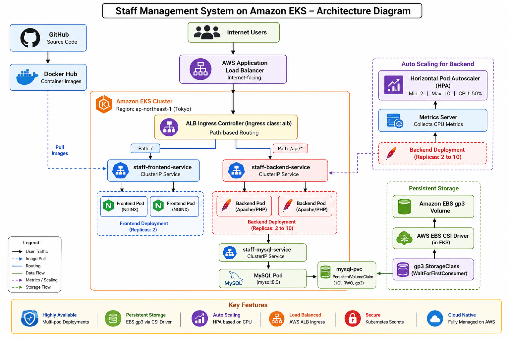

### Application Traffic Flow

```text
                         INTERNET USERS
                                |
                                v
                  AWS APPLICATION LOAD BALANCER
                                |
                                v
                          ALB INGRESS
                                |
               +----------------+----------------+
               |                                 |
               v                                 v
            Path /                           Path /api/*
               |                                 |
               v                                 v
    staff-frontend-service            staff-backend-service
           ClusterIP                         ClusterIP
               |                                 |
        +------+------+                  +-------+-------+
        |             |                  |               |
        v             v                  v               v
  Frontend Pod   Frontend Pod      Backend Pod     Backend Pod
     NGINX          NGINX           Apache/PHP      Apache/PHP
                                              |
                                              v
                                   staff-mysql Service
                                         ClusterIP
                                              |
                                              v
                                          MySQL Pod
                                              |
                                              v
                                          mysql-pvc
                                              |
                                              v
                                      gp3 StorageClass
                                              |
                                              v
                                       EBS CSI Driver
                                              |
                                              v
                                      Amazon EBS Volume
```

The backend Deployment is monitored using Kubernetes Metrics Server and Horizontal Pod Autoscaler.

```text
Backend Pods
     |
     v
Metrics Server
     |
     v
Horizontal Pod Autoscaler
     |
     v
Scale Backend Pods
Minimum: 2
Maximum: 10
CPU Target: 50%
```

---

## Technologies Used

### AWS Services

- Amazon EKS
- Amazon EC2
- Amazon EBS
- Elastic Load Balancing
- AWS Identity and Access Management
- AWS CloudFormation

### DevOps and Cloud-Native Tools

- Docker
- Docker Hub
- Kubernetes
- eksctl
- kubectl
- Helm
- Git
- GitHub

### Application Stack

- NGINX
- Apache HTTP Server
- PHP
- MySQL 8.0

---

## Amazon EKS Cluster

The Staff Management System is deployed on Amazon EKS in the AWS Tokyo Region.

### Cluster Configuration

```text
Cluster Name       : staff-management-cluster
AWS Region         : ap-northeast-1
Region             : Asia Pacific (Tokyo)
Kubernetes Version : 1.34
Node Group         : staff-worker-nodes
Instance Type      : c7i-flex.large
Desired Nodes      : 2
Minimum Nodes      : 2
Maximum Nodes      : 4
```

### EKS Cluster Overview

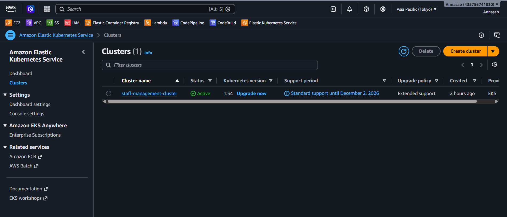

The EKS cluster configuration is defined in:

```text
eks-cluster.yaml
```

The cluster was created using `eksctl`.

```powershell
eksctl create cluster -f .\eks-cluster.yaml --profile eks-admin
```

---

## EKS Worker Nodes

The EKS managed node group provides the compute capacity required to run Kubernetes workloads.

The cluster uses two worker nodes distributed by the EKS managed node group.

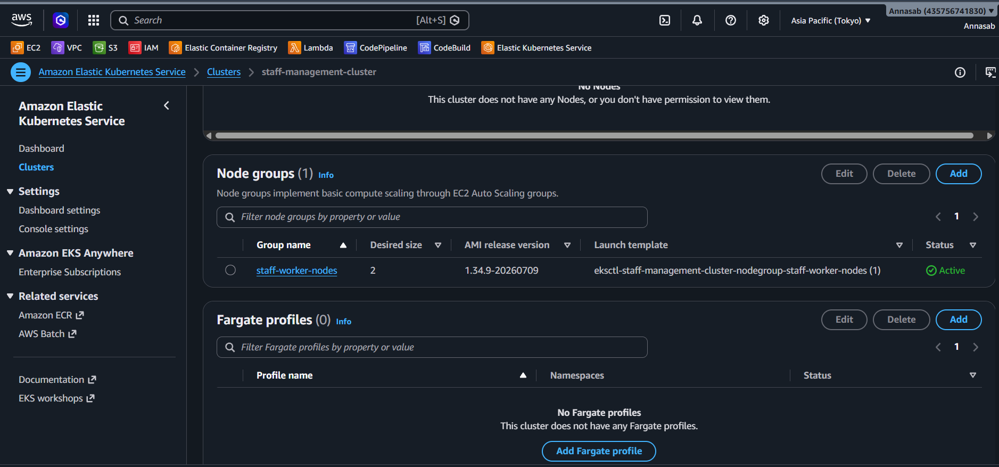

The Kubernetes nodes were verified using:

```powershell
kubectl get nodes -o wide
```

Both nodes successfully joined the cluster and reached the `Ready` state.

---

## Kubernetes Namespace

All application resources are deployed inside a dedicated Kubernetes namespace:

```text
staff-management
```

The project uses the following Kubernetes resources:

- Namespace
- Deployments
- ClusterIP Services
- PersistentVolumeClaim
- StorageClass
- Secret
- HorizontalPodAutoscaler
- Ingress

---

## Kubernetes Workloads

The application contains separate Kubernetes workloads for the frontend, backend, and MySQL database.

### Running Pods

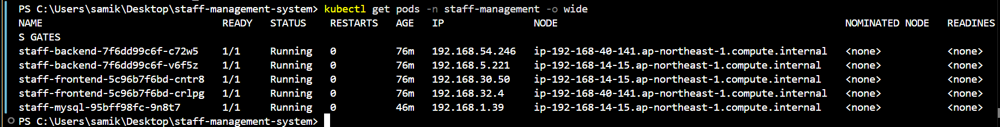

The deployed application contains:

```text
Frontend Pods : 2
Backend Pods  : 2
MySQL Pods    : 1
```

Kubernetes Deployments maintain the required replica count and automatically recreate failed Pods.

---

## Kubernetes Services

ClusterIP Services provide internal application communication.

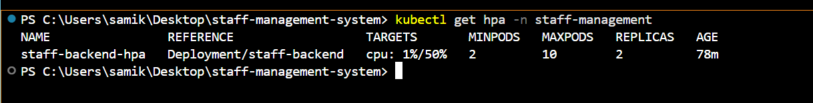

The application uses:

```text
staff-frontend-service
staff-backend-service
staff-mysql
```

### Internal Communication

```text
ALB Ingress
     |
     +----> staff-frontend-service
     |              |
     |              v
     |         Frontend Pods
     |
     +----> staff-backend-service
                    |
                    v
               Backend Pods
                    |
                    v
               staff-mysql
                    |
                    v
                MySQL Pod
```

The frontend and backend Services are not directly exposed using NodePort or LoadBalancer Services.

Public traffic is handled through the AWS Application Load Balancer and Kubernetes Ingress.

---

## Frontend Deployment

The frontend application runs using NGINX.

```text
Deployment      : staff-frontend
Container Image : annasab12/staff-management-frontend:v2
Replicas        : 2
Container Port  : 80
```

The frontend is internally exposed using:

```text
staff-frontend-service
```

The ALB routes `/` requests to the frontend Service.

---

## Backend Deployment

The backend API runs using Apache HTTP Server and PHP.

```text
Deployment      : staff-backend
Container Image : annasab12/staff-management-backend:v1
Replicas        : 2
Container Port  : 80
```

The backend is internally exposed using:

```text
staff-backend-service
```

The ALB routes `/api/*` requests to the backend application.

### Backend API Endpoints

```text
/api/getEmployees.php
/api/getDashboardStats.php
/api/getHierarchy.php
/api/addEmployee.php
```

---

## Horizontal Pod Autoscaler

The backend Deployment uses Kubernetes Horizontal Pod Autoscaler.

### HPA Configuration

```text
Target Deployment : staff-backend
Minimum Replicas   : 2
Maximum Replicas   : 10
CPU Target         : 50%
```

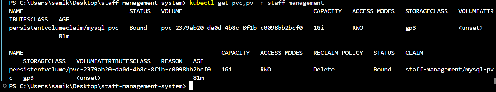

The Kubernetes Metrics Server provides CPU metrics to the Horizontal Pod Autoscaler.

### Autoscaling Flow

```text
Backend CPU Utilization
          |
          v
     Metrics Server
          |
          v
Horizontal Pod Autoscaler
          |
          v
staff-backend Deployment
          |
          v
Scale Pods Between 2 and 10
```

---

## MySQL Database

MySQL 8.0 is used as the application database.

```text
Database : sams_db
Service  : staff-mysql
Port     : 3306
```

The database contains the following tables:

```text
employees
projects
hierarchy
```

The database schema is stored in:

```text
database/sams.sql
```

The schema contains initial application data used to verify the backend APIs.

---

## Amazon EBS Persistent Storage

Amazon EBS provides persistent storage for the MySQL database.

The MySQL container mounts the persistent volume at:

```text
/var/lib/mysql
```

### PersistentVolumeClaim and PersistentVolume

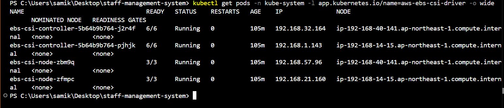

The storage configuration is:

```text
PersistentVolumeClaim : mysql-pvc
StorageClass          : gp3
Storage Requested     : 1 GiB
Access Mode           : ReadWriteOnce
```

### Storage Architecture

```text
MySQL Container
       |
       v
/var/lib/mysql
       |
       v
mysql-pvc
       |
       v
gp3 StorageClass
       |
       v
AWS EBS CSI Driver
       |
       v
Amazon EBS gp3 Volume
```

The MySQL Pod was replaced during a Kubernetes Deployment rollout.

After the new Pod started, the existing `employees`, `projects`, and `hierarchy` tables remained available.

This verified persistent database storage using Amazon EBS.

---

## AWS EBS CSI Driver

The AWS EBS CSI Driver is installed as an Amazon EKS add-on.

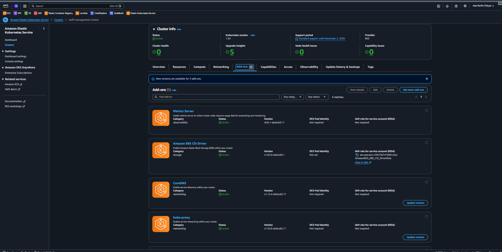

The CSI driver dynamically provisions Amazon EBS volumes for Kubernetes PersistentVolumeClaims.

The project uses the following provisioner:

```text
ebs.csi.aws.com
```

The StorageClass provisions encrypted Amazon EBS gp3 volumes.

```yaml
parameters:
  type: gp3
  encrypted: "true"
```

---

## Kubernetes Secret

The MySQL root password is injected into the MySQL container using a Kubernetes Secret.

The Deployment references the Secret using `secretKeyRef`.

```yaml
env:
  - name: MYSQL_ROOT_PASSWORD
    valueFrom:
      secretKeyRef:
        name: mysql-secret
        key: mysql-root-password
```

The real `mysql-secret.yaml` manifest is excluded from Git tracking using `.gitignore`.

This prevents the database password from being committed to the public GitHub repository.

---

## AWS Load Balancer Controller

The AWS Load Balancer Controller was installed in the EKS cluster using Helm.

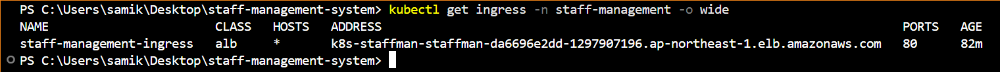

Two controller Pods run in the `kube-system` namespace.

The controller monitors Kubernetes Ingress resources and creates AWS Elastic Load Balancing resources.

The controller uses an IAM service account associated with an IAM role.

---

## AWS Application Load Balancer

The Kubernetes Ingress provisions an internet-facing AWS Application Load Balancer.

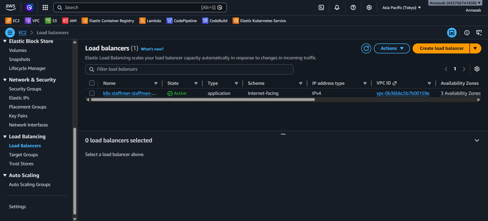

The Ingress uses the following annotations:

```yaml
annotations:
  alb.ingress.kubernetes.io/scheme: internet-facing
  alb.ingress.kubernetes.io/target-type: ip
```

The ALB uses IP target mode.

This allows the load balancer target groups to route traffic directly to Kubernetes Pod IP addresses.

---

## ALB Target Groups

The AWS Load Balancer Controller automatically creates target groups for the Kubernetes Services referenced by the Ingress.

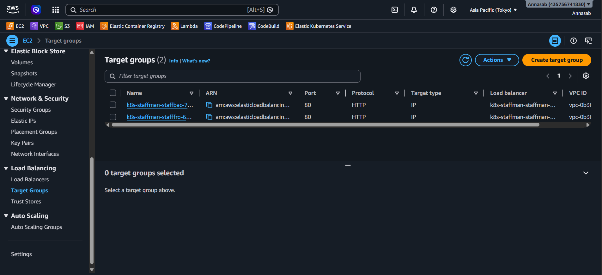

The architecture uses separate routing targets for the frontend and backend workloads.

```text
Path /
   |
   v
Frontend Target Group
   |
   v
Frontend Pod IPs
```

```text
Path /api/*
   |
   v
Backend Target Group
   |
   v
Backend Pod IPs
```

Healthy registered targets verify communication between the Application Load Balancer and Kubernetes Pods.

---

## Kubernetes ALB Ingress

The Kubernetes Ingress defines path-based application routing.

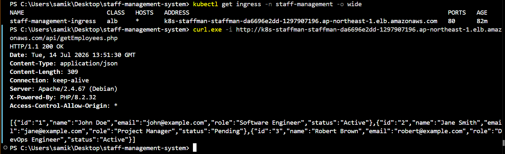

The Ingress class is:

```text
alb
```

### Routing Rules

```text
/       -> staff-frontend-service
/api    -> staff-backend-service
```

### Request Flow

```text
Internet User
      |
      v
AWS Application Load Balancer
      |
      v
Kubernetes ALB Ingress
      |
      +-------------------+
      |                   |
      v                   v
     /                  /api
      |                   |
      v                   v
Frontend Service     Backend Service
      |                   |
      v                   v
Frontend Pods        Backend Pods
```

---

## Running Application

The Staff Management System is publicly accessible through the AWS Application Load Balancer.

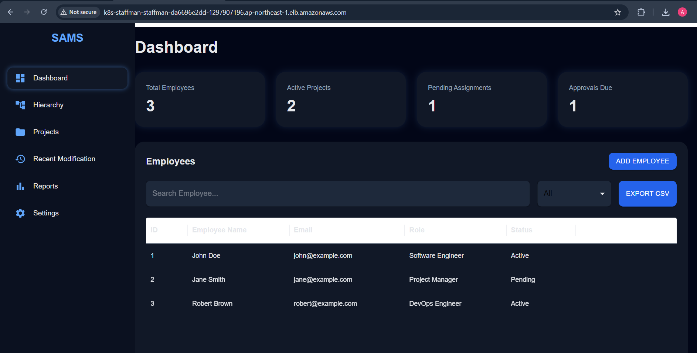

The dashboard successfully displays:

```text
Total Employees     : 3
Active Projects     : 2
Pending Assignments : 1
Approvals Due       : 1
```

The employee table displays:

```text
John Doe
Jane Smith
Robert Brown
```

This verifies successful communication across the complete application architecture.

```text
Browser
   |
   v
Application Load Balancer
   |
   v
Frontend
   |
   v
Backend API
   |
   v
MySQL Database
```

---

## Employee API Verification

The employee API was tested through the public Application Load Balancer.

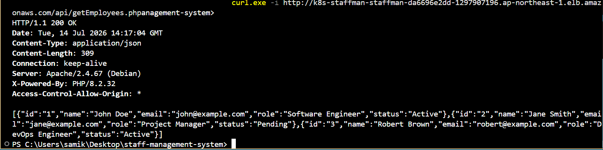

API endpoint:

```text
/api/getEmployees.php
```

The API returned:

```text
HTTP/1.1 200 OK
Content-Type: application/json
```

The response contained employee records stored in the MySQL database.

This verifies:

```text
ALB
 |
 v
Ingress
 |
 v
Backend Service
 |
 v
PHP Backend
 |
 v
MySQL Service
 |
 v
MySQL Database
```

---

## Deployment Workflow

```text
Application Source Code
          |
          v
        GitHub
          |
          v
Build Docker Images
          |
          v
      Docker Hub
          |
          v
      Amazon EKS
          |
          v
Kubernetes Deployments
          |
     +----+----+
     |         |
     v         v
 Frontend    Backend
                 |
                 v
               MySQL
          |
          v
AWS Application Load Balancer
          |
          v
     Internet Users
```

---

## CI/CD Automation with GitHub Actions

The project implements an automated CI/CD pipeline using GitHub Actions.

Whenever code is pushed to the `main` branch, the workflow automatically builds the frontend and backend Docker images, pushes commit-specific images to Docker Hub, authenticates to AWS using GitHub OIDC, connects to the Amazon EKS cluster, and performs Kubernetes rolling updates.

### CI/CD Workflow

```text
Developer
    |
    v
Git Push
    |
    v
GitHub Actions
    |
    +--> Build Frontend Docker Image
    |
    +--> Build Backend Docker Image
    |
    v
Docker Hub
    |
    v
GitHub OIDC
    |
    v
AWS IAM Role
    |
    v
Amazon EKS
    |
    v
Kubernetes Rolling Update
    |
    v
Application Load Balancer
    |
    v
Staff Management Application
```

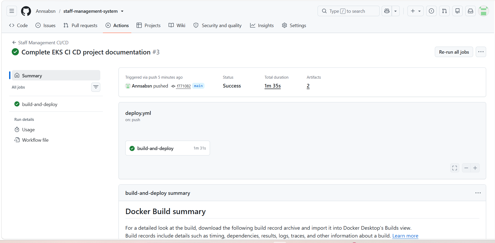

The pipeline uses Git commit SHA-based Docker image tags to provide traceable and reproducible Kubernetes deployments.

---

## Project Structure

```text
staff-management-system/
|
+-- backend/
|
+-- frontend/
|
+-- database/
|   +-- sams.sql
|
+-- .github/
|   +-- workflows/
|       +-- deploy.yml
|
+-- docs/
|   +-- eks-architecture.png
|   |
|   +-- screenshots/
|       +-- 01-eks-cluster.png
|       +-- 02-worker-nodes.png
|       +-- 03-kubernetes-pods.png
|       +-- 04-kubernetes-services.png
|       +-- 05-backend-hpa.png
|       +-- 06-persistent-storage.png
|       +-- 07-ebs-csi-driver.png
|       +-- 08-load-balancer-controller.png
|       +-- 09-application-load-balancer.png
|       +-- 10-target-groups.png
|       +-- 11-alb-ingress.png
|       +-- 12-running-application.png
|       +-- 13-employee-api.png
|       +-- 14-github-actions-pipeline.png
|
+-- kubernates/
|   +-- namespace.yaml
|   +-- frontend-deployment.yaml
|   +-- frontend-service.yaml
|   +-- backend-deployment.yaml
|   +-- backend-service.yaml
|   +-- backend-hpa.yaml
|   +-- mysql-deployment.yaml
|   +-- mysql-service.yaml
|   +-- mysql-pvc.yaml
|   +-- storageclass.yaml
|   +-- ingress.yaml
|
+-- eks-cluster.yaml
|
+-- iam_policy.json
|
+-- README.md
```

---

## Challenges and Troubleshooting

### EKS Managed Node Group Creation Failure

The initial EKS cluster deployment in the Mumbai AWS Region experienced a managed node group failure.

CloudFormation reported:

```text
NodeCreationFailure
Unhealthy nodes in the kubernetes cluster
```

The failed cluster resources were investigated using AWS CLI and CloudFormation stack events.

The cluster was cleaned up and successfully recreated in the Tokyo AWS Region.

The managed worker nodes successfully joined the Kubernetes cluster.

---

### ALB DNS Resolution Delay

Immediately after the Application Load Balancer was provisioned, the ALB hostname temporarily failed DNS resolution.

The DNS record was verified using:

```powershell
nslookup <ALB-DNS>
```

After DNS propagation, the hostname resolved successfully and the frontend returned:

```text
HTTP/1.1 200 OK
```

---

### Backend API Directory Returned 403

Accessing:

```text
/api/
```

returned:

```text
403 Forbidden
```

The backend API directory did not contain a DirectoryIndex resource.

The application uses individual PHP endpoints.

```text
/api/getEmployees.php
/api/getDashboardStats.php
/api/getHierarchy.php
```

The individual endpoints successfully returned HTTP `200 OK`.

---

### Missing MySQL Database Tables

The `sams_db` database initially existed without application tables.

Backend APIs reported:

```text
Table 'sams_db.employees' doesn't exist
```

The SQL schema was located at:

```text
database/sams.sql
```

The schema was imported into the MySQL Pod.

The following tables were successfully created:

```text
employees
projects
hierarchy
```

After database initialization, all tested backend APIs successfully returned application data.

---

### Frontend Displayed Zero Dashboard Data

The frontend application loaded successfully, but the dashboard displayed:

```text
Total Employees     : 0
Active Projects     : 0
Pending Assignments : 0
Approvals Due       : 0
```

The employee table also displayed no records.

The deployed frontend JavaScript was inspected inside the NGINX container.

The frontend was configured with:

```text
http://localhost:8081/api
```

In a browser, `localhost` refers to the user's local computer rather than the backend running in Amazon EKS.

The frontend API base URL was corrected to:

```text
/api
```

The corrected frontend Docker image was built and pushed as:

```text
annasab12/staff-management-frontend:v2
```

The Kubernetes frontend Deployment was updated to use version `v2`.

The new request flow became:

```text
Browser
   |
   v
/api
   |
   v
AWS Application Load Balancer
   |
   v
ALB Ingress
   |
   v
Backend ClusterIP Service
   |
   v
PHP Backend Pods
   |
   v
MySQL Database
```

After the frontend rollout, dashboard statistics and employee records were displayed successfully.

---

## Final Deployment Status

```text
EKS Cluster                  : Running
AWS Region                   : Tokyo
Worker Nodes                 : 2 Ready
Frontend Pods                : 2 Running
Backend Pods                 : 2 Running
MySQL Pod                    : 1 Running
MySQL PVC                    : Bound
StorageClass                 : gp3
AWS EBS CSI Driver           : Active
Metrics Server               : Active
Horizontal Pod Autoscaler    : Active
AWS Load Balancer Controller : Running
ALB Ingress                  : Active
Frontend                     : Working
Employee API                 : 200 OK
Dashboard API                : 200 OK
Hierarchy API                : 200 OK
Persistent MySQL Data        : Verified
```

---

## Key DevOps Concepts Demonstrated

- Amazon EKS cluster deployment
- Managed Kubernetes worker nodes
- Containerized three-tier application deployment
- Kubernetes Deployments
- Kubernetes ClusterIP Services
- Kubernetes namespace isolation
- Multi-Pod workload deployment
- AWS Application Load Balancer
- Kubernetes Ingress
- ALB path-based routing
- AWS Load Balancer Controller
- Pod IP target mode
- Amazon EBS persistent storage
- AWS EBS CSI Driver
- Kubernetes PersistentVolumeClaim
- Dynamic volume provisioning
- Kubernetes StorageClass
- Kubernetes Secrets
- Horizontal Pod Autoscaling
- Kubernetes Metrics Server
- IAM Roles for Service Accounts
- IAM OIDC provider integration
- Helm package management
- Docker image versioning
- Kubernetes rolling updates
- AWS CloudFormation troubleshooting
- EKS node group troubleshooting
- ALB DNS troubleshooting
- Full-stack application debugging
- CI/CD pipeline automation with GitHub Actions
- GitHub OIDC authentication to AWS
- Commit SHA-based Docker image tagging
- Automated Kubernetes rolling updates

---

## Conclusion

This project demonstrates the deployment of a containerized three-tier Staff Management System on Amazon EKS.

The frontend, backend, and MySQL database are deployed as Kubernetes workloads. ClusterIP Services provide internal service communication, while an AWS Application Load Balancer provides public application access through Kubernetes Ingress and path-based routing.

Amazon EBS gp3 provides persistent MySQL database storage through the AWS EBS CSI Driver. Kubernetes Horizontal Pod Autoscaler dynamically manages backend replicas using CPU utilization metrics from the Metrics Server.

Kubernetes Secrets are used to provide database credentials to the MySQL container, while IAM Roles for Service Accounts provide AWS permissions to Kubernetes workloads and controllers.

A GitHub Actions CI/CD pipeline automates the build and deployment process, using GitHub OIDC to authenticate to AWS and commit SHA-based Docker image tags to perform traceable, reproducible Kubernetes rolling updates.

The project demonstrates practical experience with AWS, Amazon EKS, Kubernetes, Docker, persistent storage, autoscaling, load balancing, IAM, Helm, CI/CD automation, application deployment, and real-world cloud troubleshooting.
